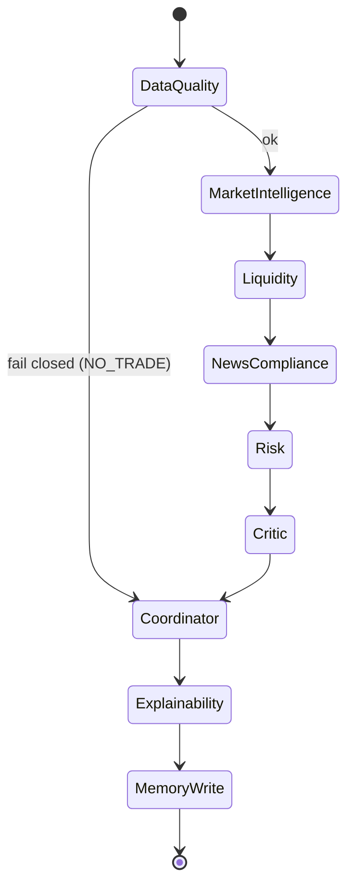

# Session Edge — Phase 4A Multi-Agent Architecture, Contracts & Memory

**Status:** DESIGN + FOUNDATION ONLY. The agent layer is **advisory**. No agent
or service can place a trade, alter an order, write a bridge instruction, reach
the network, or override a deterministic gate. The deterministic Session Edge
strategy, the filesystem bridge, and the MT5 adapter are **unchanged** and remain
authoritative and outside this layer.

Implementation: `forex_swing_orb/agents/` (stdlib-only, no networking). Single
sources of truth are reused, not duplicated: serialization/hashing and the audit
contract come from `forex_swing_orb/bridge/`.

---

## 1. Architecture summary

Session Edge’s intelligence layer is a fixed, deterministic **pipeline of
advisory agents** around the unchanged deterministic strategy. The strategy
decides *whether a setup exists*; the agents *review context and challenge it*;
a deterministic coordinator emits **one advisory decision**; deterministic
gates + bridge + MT5 remain the only path to a real order.

```
market & news data
  → deterministic Session Edge strategy  (authoritative: setup or no-setup)
  → agent advisory review (this layer)    (advisory only; never creates a trade)
  → deterministic risk / compliance gates
  → approved trade instruction
  → filesystem bridge (Phase 2)
  → MT5 execution adapter (Phase 3)
```

The agent layer emits **advice + evidence + explanation + memory**, never an
order.

---

## 2. Agent responsibility matrix

| # | Agent | Type | LLM? | Responsibilities | May NOT |
|---|---|---|---|---|---|
| 1 | Market Intelligence | live | eligible | regime, HTF structure, session, volatility, trend-continuation, ranging-vs-trending — interpret & summarize | recompute strategy; create direction |
| 2 | Liquidity | live | eligible | equal highs/lows, session/swing highs-lows, pools, sweeps, failed breakouts, stop clusters, trap risk, retest quality → FAVORABLE/CAUTION/AVOID | create direction; place trades |
| 3 | News & Compliance | live | **deterministic** | ingest normalized events, map currencies→pair, pre/post lockout windows → CLEAR/CAUTION/BLOCK; fail closed | create direction; use an LLM |
| 4 | Risk | live | **deterministic** | one-position-per-symbol, correlated exposure, planned R:R, account/daily-loss/drawdown limits, stop-distance sanity, sizing eligibility → CLEAR/CAUTION/BLOCK | execute/size orders; touch broker |
| 5 | Critic | live | eligible | argue against setup; late-trend, liquidity-trap, news-conflict, weak-health, insufficient-evidence → CLEAR-objection/CAUTION/BLOCK | approve a trade |
| 6 | Decision Coordinator | live | **deterministic** | order agents, collect outputs, verify evidence, apply deterministic policy, one advisory decision, preserve all evidence/reason codes | be a strategy engine; override a strategy rejection |
| — | Research | **offline** | eligible | strategy research, hypotheses, backtest review, parameter proposals | modify production; act live |
| — | Performance Analytics | **offline** | deterministic | outcome/regime/liquidity/news/execution analysis, drift detection | modify production; act live |

Domain labels map onto **one canonical scale** `CLEAR < CAUTION < BLOCK`
(Liquidity `FAVORABLE/CAUTION/AVOID` and News `CLEAR/CAUTION/BLOCK` alias into it).

---

## 3. Duplication / ownership matrix (single source of truth)

| Capability | Sole owner | Notes |
|---|---|---|
| Market regime / context | Market Intelligence Agent | interprets only; strategy authoritative |
| Liquidity logic | Liquidity Agent | only producer of liquidity ratings |
| News filtering / lockout | News & Compliance Agent | deterministic; only news gate |
| Risk rules | Risk Agent | deterministic; no execution |
| Decision policy | Decision Coordinator | only place advisory decisions are formed |
| Explainability | Explainability Service | one service; not a decision-maker |
| Memory storage | `MemoryStore` | one store; no per-agent memory |
| Model access | `LLMProvider` | one abstraction; one shared instance injected |
| Serialization / hashing / IDs | `bridge.serialize` | reused, not re-implemented |
| Audit | `bridge.audit.AuditLog` | one contract, reused |
| Order placement | MT5 adapter (Phase 3) | **outside** the agent layer entirely |

No unavoidable duplication was found. Overlaps that could have arisen
(regime vs strategy, risk vs execution sizing, per-agent memory/model clients)
are resolved by assignment above and enforced by tests.

---

## 4. Versioned agent input/output schemas (`schema_version = 1`)

**Input envelope** (`contract.build_request` / `validate_request`):
`schema_version, request_id, symbol, evaluation_timestamp, strategy_id,
strategy_version, market_data_reference, news_data_reference,
memory_context_reference, correlation_id`.

**Output result** (`contract.build_result` / `validate_result`):
`schema_version, agent_id, agent_version, request_id, correlation_id, symbol,
assessment, confidence, evidence, reason_codes, data_freshness, missing_inputs,
model_id?, prompt_version?, generated_timestamp`.

Rules: unknown `schema_version` → reject; missing required field → fail closed;
`assessment ∈ {CLEAR,CAUTION,BLOCK}`; `confidence ∈ [0,1]`; if an LLM was used
**both** `model_id` and `prompt_version` must be present. A natural-language
explanation may ride in `evidence` but never replaces the structured result.

**Confidence scale (one, advisory):** float `[0,1]`, bands LOW `<0.34`,
MEDIUM `<0.67`, HIGH `≥0.67`. Confidence never overrides a strategy/compliance/
risk/stale-data/news/kill-switch rejection.

---

## 5. Shared memory schema (one store)

Tiers under a single `MemoryStore` root:
- `raw/` — **immutable**, append-only, content-addressed records
  (`raw_schema_version, id, kind, subject, content, source, timestamp,
  correlation_id`). Same content → same id, written at most once, never mutated.
- `derived/` — **versioned** summaries (`key, kind, subject, version, summary,
  source, timestamp`); each write is a new version; prior versions are retained.
- `raw_index.jsonl` — query index; `memory_audit.jsonl` — audit trail
  (bridge audit contract).

Record kinds (one taxonomy): `market_context, agent_assessment,
strategy_decision, rejected_setup, generated_signal, execution_outcome, pnl,
news_condition, liquidity_observation, risk_decision, critic_objection, lesson,
model_prompt_version`.

Guarantees: structured schema, timestamps, **source provenance required**,
immutable raw, versioned derived, deterministic IDs, retention accounting,
one query interface, audit trail, no per-agent stores. **Memory never silently
changes live rules** — it informs research/reporting only unless a future
governed process approves a change.

---

## 6. Shared LLM provider interface (one abstraction)

`llm.LLMProvider` — the single model abstraction; `complete(prompt, *,
prompt_version, …) -> LLMResponse(text, model_id, prompt_version, …)`. One shared
instance is injected into every LLM-eligible agent (no per-agent clients). This
phase ships only `MockLLMProvider` (deterministic, **offline**, no networking).

- **LLM-eligible:** Market Intelligence, Liquidity, Critic, Research, memory
  summarization, explainability.
- **Deterministic-only (LLM forbidden):** Risk, News lockout, Compliance gates,
  Decision Coordinator, Data Quality, Bridge, Execution, Dedup, Reconciliation.
  Constructing a deterministic-only agent with an LLM raises.

---

## 7. Orchestration state machine (frozen order)



`ORCHESTRATION_ORDER = (data_quality, market_intelligence, liquidity,
news_compliance, risk, critic, decision_coordinator, explainability,
memory_write)`. The strategy is **outside** and authoritative; the orchestrator
receives `strategy_candidate` and never computes it. Agents never generate a
trade when the strategy produced none.

---

## 8. Explainability contract (one service)

`ExplainabilityService.explain(request, agent_results, decision, data_quality)`
→ `{final_assessment, confidence, confidence_band, reason_codes, evidence_used,
agent_outputs (with model_id/prompt_version), conflicts, missing_data, why,
is_decision_maker=false}`. It explains a decision already made; it never decides.

---

## 9. Audit contract (reused, one format)

The agent layer reuses `bridge.audit.AuditLog` — one JSONL line per action
(`timestamp, action, outcome, reason_code, signal_id, detail`). The orchestrator
emits `orchestrate/DATA_QUALITY`, one `agent/<assessment>` per agent, the
coordinator decision, and `orchestrate/DONE`; the memory store emits
`memory_write`. No separate/incompatible per-agent audit format.

---

## 10. Data-quality contract (deterministic gate)

`data_quality.validate(request, bundle, now, max_age_sec)` runs **before** any
agent and fails closed on: missing required data, non-monotonic timestamps,
stale/implausibly-future data, missing provenance, invalid symbol mapping,
missing timezone, malformed records. A failure halts the pipeline → coordinator
returns `ADVISE_NO_TRADE` (`COORD_BLOCK_DATA_QUALITY`).

---

## 11. Security & authority boundaries

- **No trading authority.** Agents/coordinator emit advice + evidence only
  (`is_order = false`); no order fields are ever present on a decision.
- **No bridge/execution access.** The agent layer never imports the producer,
  `ea_mt5`, claim/atomic-claim, or order APIs (enforced by test).
- **No networking.** No sockets/HTTP/REST/RPC/URLs anywhere in the layer
  (enforced by test). The only network-capable component (a future real LLM
  provider) is isolated behind the single abstraction and is not in the
  execution path.
- **Hard, non-overridable rejections:** strategy no-trade, data-quality failure,
  news BLOCK, risk BLOCK, any agent BLOCK, stale data, kill switch. Confidence is
  advisory and never overrides them.
- **Deterministic safety-critical components never use an LLM.**
- **Offline components** (Research, Performance Analytics) carry
  `LIVE_AUTHORITY = False`, are not wired into the orchestrator, and never
  auto-apply changes.

---

## 12. Test plan (implemented — 68 tests)

Contract (schema-version reject, missing-input fail-closed, confidence range,
canonical serialization, reason-code stability, LLM provenance pairing);
per-agent behaviour (valid results, stale/missing/malformed fail-closed, news
lockout, risk rules, liquidity ratings, deterministic-only rejects LLM, Critic
cannot approve); orchestration (frozen order; strategy/news/risk/data-quality
non-override; caution flow; explanation present; confidence never overrides);
authority (no networking, no execution/producer imports, no execution methods,
decision is not an instruction, reuse-only bridge imports); shared services (one
memory, one LLM instance across agents, one explainability, complete audit,
model/prompt capture, deterministic LLM); memory (provenance required, immutable
raw, deterministic ids, versioned derived, query, audit); no-duplication (unique
agent ids, single coordinator/explainability/memory/LLM, no duplicate
serializer, offline no-authority). Covers all 26 required checks.

---

## 13. Phase roadmap (incremental agent implementation)

- **4A (this phase):** contracts, shared services, orchestration skeleton,
  deterministic stubs, tests, docs. *(complete)*
- **4B:** flesh out deterministic agents (News lockout tables + approved calendar
  source contract; full Risk rule set) — still no live authority.
- **4C:** wire the real strategy candidate + deterministic gates into the
  orchestrator in **shadow mode** (advisory logged beside live decisions, never
  acting).
- **4D:** integrate a real LLM provider behind the single abstraction for the
  LLM-eligible agents (Market Intelligence, Liquidity, Critic) — advisory only.
- **4E:** Explainability + Voice implementation (one outward voice).
- **4F:** Offline Research + Performance Analytics activation (read-only) and a
  governed change-approval process for any memory-informed rule change.
- **Prereq for any live authority:** the Phase 3 MQL5 live-broker gate and the
  Phase 3A O(N²) hardening, plus a formal authority review.

---

## Final disposition

**READY FOR AGENT IMPLEMENTATION.** The foundation — versioned contracts, one
shared memory/LLM/explainability/audit, the frozen orchestration skeleton,
deterministic stubs, and the non-override authority boundaries — is in place,
tested, and free of duplication, with the strategy/bridge/EA untouched and no
live trading authority granted.
